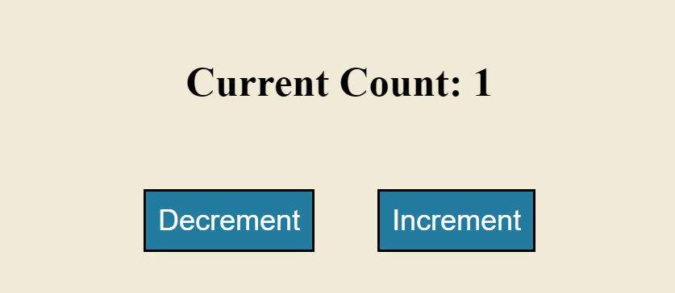
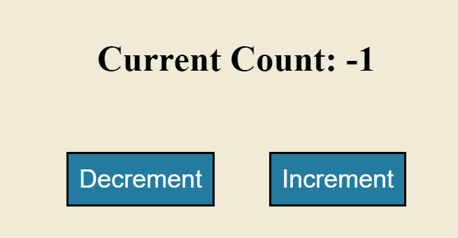

# Event-Handler-on-Click

  

## Functionality

- When user clicks on increment button, the count is then increased by 1 each time.
- When user clicks on decrement button, the count is then decreases by 1 each time.

## Deployed Application

[Link](https://ally27.github.io/Event-Handler-on-Click/)
